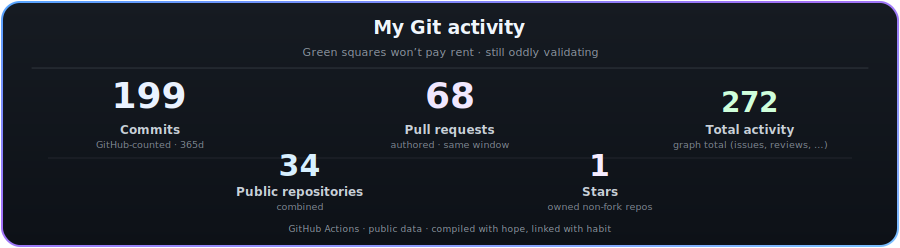

<table align="center" cellpadding="0" cellspacing="0">
<tr>
<td valign="middle">

</td>
<td valign="middle" style="padding-left:6px">

</td>
</tr>
</table>

 

<strong>Tech Geek</strong> · <strong>India</strong> · Java · Python · Spring · Django · APIs · DevOps · CI/CD · automation · <strong>production first</strong>

---

## Overview

**Tech Geek** based in **India** — **production first**, not demo first. I care how things behave under real load, real users, and real Mondays. **12+ years** of shipping work that has to hold up after the handoff: clear ownership, honest automation, and systems the next person can reason about — without needing a séance.

## How I work

I’ve shipped **30+** projects across production-grade systems in different domains — places where *“works on my machine”* isn’t enough. I’m happiest **teaching through delivery**: pairing, solid documentation, PRs that explain *why*, turning incidents into durable team knowledge, and keeping **signals in prod** honest enough that releases stay boring.

## Working style

| | |
|:---|:---|
| **Mindset** | **Tech Geek** energy — depth-first, evidence-led, **production**-disciplined |
| **Delivery** | Scope, timelines, and production risk treated seriously |
| **Quality** | Automated checks in CI; logs and metrics when something still slips through |
| **Tone** | Light when appropriate — never where it obscures severity or logs |
| **Collaboration** | Ask *why*; I’ll trade opinions for data and tradeoffs |
| **Direction** | Pragmatic today; curious about what’s next in the platform |

## Stack & tools

  
  
  
  
  
  
  
  
  
  

Frontend when needed. Centering a <code>div</code> still negotiable — terms and conditions may apply.

---

## GitHub activity

  

<strong>Per-account cards</strong> <em>(same metrics, not merged)</em>

**[@subhramonyu](https://github.com/subhramonyu)**

  
  

**[@privatefnsventures-maker](https://github.com/privatefnsventures-maker)**

  
  

**[@SubhraFLuke](https://github.com/SubhraFLuke)**

  
  

<strong>Detailed metrics</strong> <em>(SVG generated by repository workflow)</em>

---

## Contact

| | |
|:---|:---|
| **Email** | [subhramonyu.das@gmail.com](mailto:subhramonyu.das@gmail.com) |
| **Site** | [subhramonyu.github.io](https://subhramonyu.github.io) |
| **Social** |   |

  

---

**Solid foundations so the interesting problems get the attention they deserve.**

© 2026 Subhramonyu Das · README maintained with care, coffee, and the occasional well-placed joke

  
  
  

